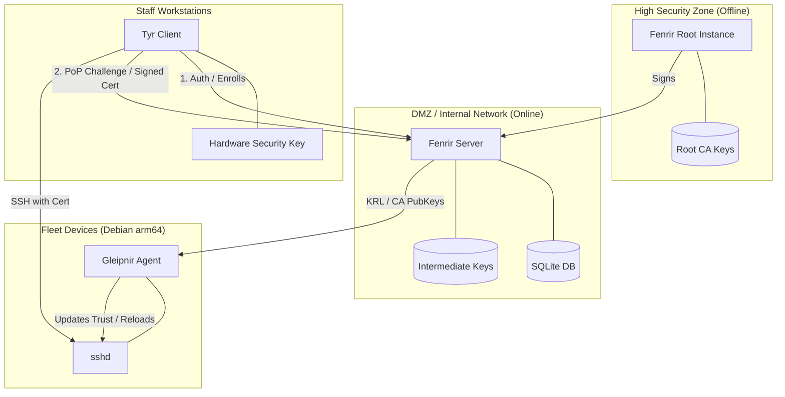

# Fenrir SSH CA

A simple, single-binary SSH Certificate Authority designed for homelabs. It features a modern Web UI (Fenrir), a fleet management agent (Gleipnir), and a workstation client (Tyr).

## 🏗 System Architecture



### 📝 Project Terminology

To ensure clarity across the ecosystem, we use the following Norse-themed components:

| Component | Actor | Use Case | Mythological Tie |
| :--- | :--- | :--- | :--- |
| **Fenrir** | The Authority | The "Brain" (Server/Web UI). Signs certificates and manages the state. | The world-shaking wolf. |
| **Tyr** | User Client | Workstation tool for humans to get certs and launch SSH. | The God who interfaces with Fenrir. |
| **Gleipnir** | Host Agent | The "binder" on target devices that ensures they trust the CA. | The unbreakable chain that binds Fenrir. |

### 🔄 Operational Flows

- **Enrollment (Initial)**: Requires a bootstrap secret (User Password or Host API Key). This associates a Public Key with an Identity (Username/Hostname) in the CA database.
- **Trust Sync**: By default, any device can fetch the CA Public Keys and KRL. In **Hardened Mode**, this requires an API Key.
- **Self-Healing Renewal**: Once a key is enrolled, it can be renewed via **Proof-of-Possession (PoP)**. The CA challenges the requester to sign a random nonce. If the signature is valid and the key is not distrusted, a new certificate is issued automatically. This allows workstations and servers to maintain their identities indefinitely without manual intervention.

## Features

- **Web UI**: Modern, dark-mode dashboard for managing certificates.
- **Single Binary**: No complex dependencies (MongoDB, Vault, etc.). Just one executable and a SQLite file.
- **Native SSH**: Uses `golang.org/x/crypto/ssh` for safe, standard-compliant certificate signing.
- **Host & User Keys**: Supports both user authentication and host verification.
- **MFA & Recovery**: Mandatory TOTP for admins with secure, single-use **Backup Codes**.
- **Passwordless Sudo**: Custom PAM module (`pam_fenrir`) for certificate-based sudo authentication.
- **Hardware Security**: Infrastructure for **PKCS#11 (HSM/YubiKey)** signing to ensure non-extractable CA keys.
- **Audit Friendly**: Detailed event logs with identity-based auditing.

## 📦 Installation
You can use the Fenrir ecosystem in two ways:

### 1. Pre-built Binaries (Recommended)
Download the latest binaries for your platform from the [Releases](https://github.com/SecareLupus/Fenrir_Homelab_SSH_CA/releases) page.
- `fenrir-*`: The main CA server.
- `tyr-*`: Command-line tool for users.
- `gleipnir-*`: Sync tool for target servers (formerly gleipnir).
- `tyr-gui-*`: Desktop control center (Linux).

### 2. Docker Images
Pull the official container from GHCR:
```bash
docker pull ghcr.io/secarelupus/fenrir:latest
```

## 🚀 Deployment Tiers

Choose the security tier that matches your homelab's risk profile. All tiers use the pre-built Docker image by default.

### 🛡️ Tier 1: Online CA (Max Convenience)
Everything runs in a single container. Good for internal-only labs.
1. Download `deploy/tier-1-online/docker-compose.yml`.
2. Run:
   ```bash
   docker compose up -d
   ```

### ❄️ Tier 2: Cold-Storage Root (Host Backed)
Two containers on one host. The Root CA remains stopped except during intermediate renewal.
1. Download `deploy/tier-2-shared-host/docker-compose.yml`.
2. Run:
   ```bash
   docker compose up -d
   ```

### 🏔️ Tier 3: Isolated Root (Max Security)
The Root CA runs on a dedicated offline machine. Highly recommended for production-grade homelabs.
1. **Prepare**: "Side-load" the Docker image to your offline machine using a USB drive (see `docs/RELEASE_PROCESS.md`).
2. **Deploy**: Use `deploy/tier-3-isolated/docker-compose.root.yml`.
3. **Workflow**: Refer to the [Offline Root Setup Workflow](.agent/workflows/offline-root-setup.md) for step-by-step signing instructions.

## 🛡️ Threat Mitigation Matrix

| Threat Category | Tier 1 | Tier 2 | Tier 2+ | Tier 3 | **+ Hardware Add-on** |
| :--- | :---: | :---: | :---: | :---: | :---: |
| **Daemon Software Bug** | ❌ Risk | ✅ Mitigated¹ | ✅ Mitigated¹ | ✅ Mitigated¹ | ❌ No change |
| **Host Root Compromise**| ❌ Full Loss | ❌ Loss | ⚠️ Partial² | ✅ Full | ✅ **Key safe** |
| **Key Exfiltration**    | ❌ Easy | ❌ Easy | ⚠️ If plugged in| ✅ Impossible | ✅ **Non-extractable** |
| **Session Hijacking**   | ❌ Risk | ✅ Mitigated³ | ✅ Mitigated³ | ✅ Mitigated³ | ⚠️ Touch required |
| **Physical Theft**      | ❌ Risk | ❌ Risk | ✅ Root on USB | ⚠️ Laptop theft | ✅ PIN required |

*¹ Root CA is stopped; bugs in the online intermediate cannot touch the root process.*  
*² If the host is compromised while the USB is unplugged, the Root identity remains safe.*  
*³ Even if an attacker hijacks the online server, they cannot reach the offline root process (stopped).*

### 🔑 Security Add-on: Hardware Keys (YubiKey/FIDO2)
Hardware keys can be added to **any tier** to ensure your CA private keys are **non-extractable**. Even if an attacker achieves full root access to your server, they cannot copy the private keys to another machine. Hardware keys transition your security from "Software-based" to "Signature-request based" (requiring a physical tap to sign).

### 4. First Login

1.  Open `http://localhost:8080`.
2.  Log in with username `admin`.
3.  **Important**: The password you use for the first time will be set as the admin password.

## 🛠 Configuration

### Tyr (User) Setup

**Method 1: Direct Login (Easiest for first-time users)**

Run `tyr` with your Fenrir credentials:
```bash
tyr --url http://your-fenrir-server:8080 --username yourname
```
You'll be prompted for your password. If MFA is enabled, you'll also be prompted for your TOTP code. Tyr will:
1. Authenticate with Fenrir
2. Receive a temporary API key
3. Auto-generate an SSH key pair (if needed)
4. Enroll the key and receive your certificate

**Method 2: API Key (For automation scripts)**

1. Log into the Fenrir Web UI
2. Click **"Generate API Key"** on the dashboard
3. Save the key to a file (e.g., `~/.fenrir-api-key`)
4. Run:
   ```bash
   tyr --url http://your-fenrir-server:8080 --key-file ~/.fenrir-api-key
   ```

**Method 3: Proof-of-Possession Renewal (Automatic after first enrollment)**

Once your key is enrolled, `tyr` can renew your certificate without credentials:
```bash
tyr --url http://your-fenrir-server:8080
```
The server will challenge you to prove possession of your private key.

### Tyr GUI Setup

1. **Launch**: Run the `tyr-gui` executable.
2. **Configure**: On first run, a Settings window will open.
3. **Login**: Enter your Fenrir URL, username, and password.
4. **Done**: The app sits in your system tray, manages your certificate lifecycle automatically, and provides a "Quick Connect" launcher.

See [Tyr GUI Authentication Guide](docs/TYR_GUI_AUTHENTICATION.md) for details.

### Gleipnir (Host) Setup

To allow users signed by this CA to log in:

1.  Copy the **User CA Key** from the dashboard.
2.  Save it to `/etc/ssh/user_ca.pub` on your target server.
3.  Edit `/etc/ssh/sshd_config`:
    ```ssh
    TrustedUserCAKeys /etc/ssh/user_ca.pub
    ```
4.  Restart sshd: `sudo systemctl restart sshd`.

## Development

- **Database**: SQLite (`fenrir.db`)
- **Keys**: Stored in `ca-keys/` directory (created on first run).

## License

This project is licensed under the **GNU General Public License v3.0** - see the [LICENSE](LICENSE) file for details.
