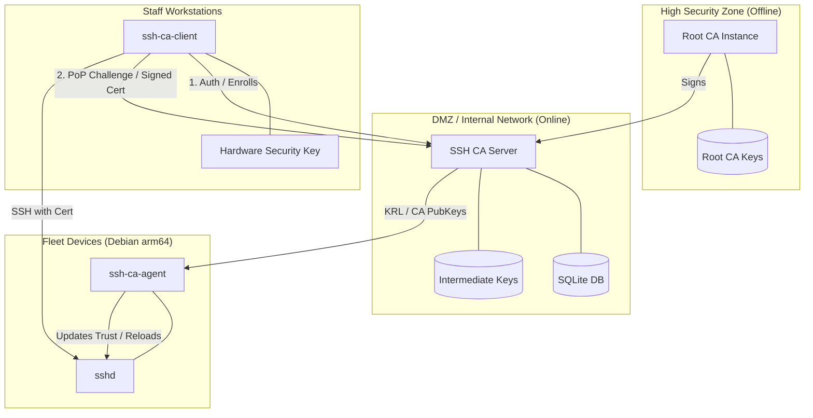

# Homelab SSH CA

A simple, single-binary SSH Certificate Authority designed for homelabs. It features a modern Web UI, SQLite backend, and native Go SSH implementation.

## 🏗 System Architecture



### Components

-   **SSH CA Server**: The brain of the system. Manages auth, policy, and signing.
-   **SSH CA Client**: Cross-platform CLI (Win/Mac/Linux) for users to request and renew certificates. Includes FIDO2/Hardware key support.
-   **SSH CA Agent**: A lightweight pull-agent for target hosts to synchronize trust material (CA keys and KRLs).

## Features

- **Web UI**: Modern, dark-mode dashboard for managing certificates.
- **Single Binary**: No complex dependencies (MongoDB, Vault, etc.). Just one executable and a SQLite file.
- **Native SSH**: Uses `golang.org/x/crypto/ssh` for safe, standard-compliant certificate signing.
- **Host & User Keys**: Supports both user authentication and host verification.
- **Audit Friendly**: Tracks certificate issuance (locally).

## 🚀 Getting Started

The server listens on `:8080`.

### 3. Running with Docker (Recommended)

#### Option A: Simple Standalone
```bash
docker compose up -d
```

#### Option B: Offline Root + Online Intermediate
This starts two instances: one for the root CA (port 8081) and one for the intermediate (port 8080).
```bash
docker compose -f docker-compose.offline.yml up -d
```
Refer to the [Offline Root Setup Workflow](.agent/workflows/offline-root-setup.md) for detailed configuration steps.

### 4. First Login

1.  Open `http://localhost:8080`.
2.  Log in with username `admin`.
3.  **Important**: The password you use for the first time will be set as the admin password.

## 🛠 Configuration

### Client (User) Setup

1.  Download your certificate from the dashboard.
2.  Save it to `~/.ssh/id_ed25519-cert.pub`.
3.  Add the Certificate Authority's public key (from the dashboard) to your known hosts if you want to trust hosts signed by this CA.

### Server (Host) Setup

To allow users signed by this CA to log in:

1.  Copy the **User CA Key** from the dashboard.
2.  Save it to `/etc/ssh/user_ca.pub` on your target server.
3.  Edit `/etc/ssh/sshd_config`:
    ```ssh
    TrustedUserCAKeys /etc/ssh/user_ca.pub
    ```
4.  Restart sshd: `sudo systemctl restart sshd`.

## Development

- **Database**: SQLite (`ssh-ca.db`)
- **Keys**: Stored in `ca-keys/` directory (created on first run).

## License

MIT
