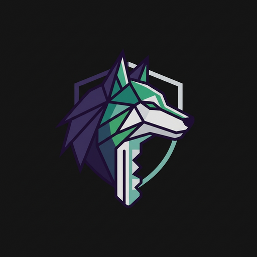
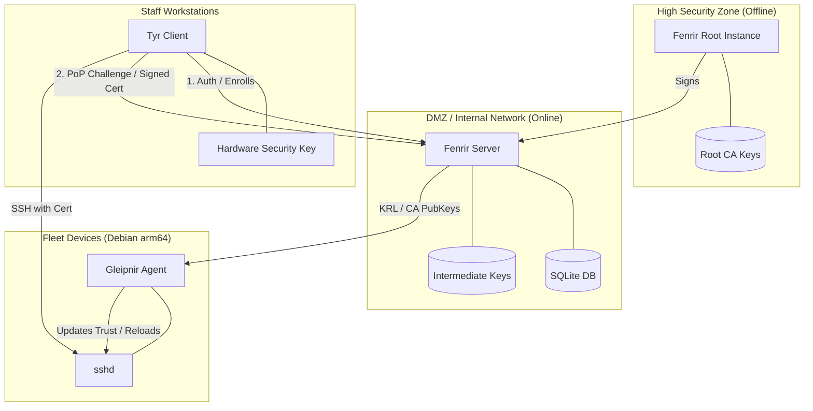

<p align="center">
  
</p>

# Fenrir SSH CA

A simple, single-binary SSH Certificate Authority designed for homelabs. It features a modern Web UI (**Fenrir**), a fleet management agent (**Gleipnir**), and a workstation client (**Tyr**).

---

## 📖 Documentation

**For in-depth guides, installation instructions, and configuration details, please visit our [GitHub Wiki](https://github.com/SecareLupus/Fenrir_Homelab_SSH_CA/wiki).**

- **[Getting Started](https://github.com/SecareLupus/Fenrir_Homelab_SSH_CA/wiki/Getting-Started)**: Install Fenrir and issue your first certificate.
- **[Docker Compose Deployment](https://github.com/SecareLupus/Fenrir_Homelab_SSH_CA/wiki/Docker-Compose-Deployment)**: Detailed guide for tiered deployments.
- **[Architecture](https://github.com/SecareLupus/Fenrir_Homelab_SSH_CA/wiki/Architecture)**: Deep dive into how Fenrir works.
- **[Tyr GUI (Native App)](<https://github.com/SecareLupus/Fenrir_Homelab_SSH_CA/wiki/Tyr-GUI-(Native-App)>)**: Using the native desktop client.
- **[Troubleshooting](https://github.com/SecareLupus/Fenrir_Homelab_SSH_CA/wiki/Troubleshooting)**: Common issues and fixes.

---

## 🏗 System Architecture



### 📝 Project Terminology

| Component    | Actor         | Use Case                                                               | Mythological Tie                         |
| :----------- | :------------ | :--------------------------------------------------------------------- | :--------------------------------------- |
| **Fenrir**   | The Authority | The "Brain" (Server/Web UI). Signs certificates and manages the state. | The world-shaking wolf.                  |
| **Tyr**      | User Client   | Workstation tool for humans to get certs and launch SSH.               | The God who interfaces with Fenrir.      |
| **Gleipnir** | Host Agent    | The "binder" on target devices that ensures they trust the CA.         | The unbreakable chain that binds Fenrir. |

---

## Features

- **🌐 Modern Web UI**: Material Design 3 dashboard for certificate management.
- **🖥 Native Desktop Client (Tyr)**: Tray integration, global hotkeys, and secure keychain storage.
- **🛡 Hardware Security**: PKCS#11/HSM support for non-extractable CA keys.
- **🔐 Advanced Authentication**: OIDC (SSO), WebAuthn (Passkeys), and PoP-based renewals.
- **⚙️ Automated Host Security**: Gleipnir agent and `pam_fenrir` for passwordless `sudo`.
- **🏗 Three-Tier Architecture**: Offline Root support for maximum security.
- **Audit Friendly**: Detailed identity-based audit logs and webhook support.

## 📦 Quick Start

### Docker Pull

```bash
docker pull ghcr.io/secarelupus/fenrir:latest
```

### Quick Run (Tier 1)

```bash
cd deploy/tier-1-online
docker compose up -d
```

_See the [Getting Started Guide](https://github.com/SecareLupus/Fenrir_Homelab_SSH_CA/wiki/Getting-Started) for first-time login and client setup._

## License

This project is licensed under the **GNU General Public License v3.0** - see the [LICENSE](LICENSE) file for details.
