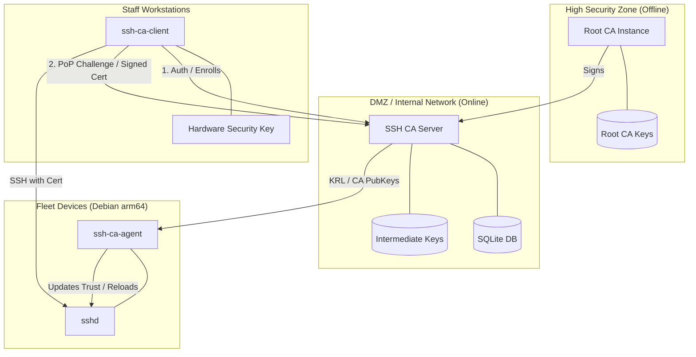

# Homelab SSH CA

A simple, single-binary SSH Certificate Authority designed for homelabs. It features a modern Web UI, SQLite backend, and native Go SSH implementation.

## 🏗 System Architecture



### Components

-   **SSH CA Server**: The brain of the system. Manages auth, policy, and signing.
-   **SSH CA Client**: Cross-platform CLI (Win/Mac/Linux) for users to request and renew certificates. Includes FIDO2/Hardware key support.
-   **SSH CA Agent**: A lightweight pull-agent for target hosts to synchronize trust material (CA keys and KRLs).

## Features

- **Web UI**: Modern, dark-mode dashboard for managing certificates.
- **Single Binary**: No complex dependencies (MongoDB, Vault, etc.). Just one executable and a SQLite file.
- **Native SSH**: Uses `golang.org/x/crypto/ssh` for safe, standard-compliant certificate signing.
- **Host & User Keys**: Supports both user authentication and host verification.
- **Audit Friendly**: Tracks certificate issuance (locally).

## 🚀 Deployment Tiers

Choose the security tier that matches your homelab's risk profile.

### 🛡️ Tier 1: Online CA (Max Convenience)
Everything runs in a single container. Good for internal-only labs.
```bash
docker compose -f deploy/tier-1-online/docker-compose.yml up -d
```

### ❄️ Tier 2: Cold-Storage Root (Host Backed)
Two containers on one host. The Root CA remains stopped except during intermediate renewal. Root keys live on the server's SSD.
```bash
docker compose -f deploy/tier-2-shared-host/docker-compose.yml up -d
```

### 🔌 Tier 2+: Removable Root (USB Backed)
Same as Tier 2, but the Root keys live on a **removable USB drive**. High protection against host-level storage compromise.
```bash
# Set ROOT_DATA_DIR to your USB mount point
export ROOT_DATA_DIR=/mnt/usb_ca/root-ca-data
docker compose -f deploy/tier-2-shared-host/docker-compose.yml up root-ca
```

### 🏔️ Tier 3: Isolated Root (Max Security)
The Root CA runs on a dedicated offline machine. CSRs and Certificates are moved via encrypted USB.
- **Offline Machine**: `deploy/tier-3-isolated/docker-compose.root.yml`
- **Online Machine**: `deploy/tier-3-isolated/docker-compose.intermediate.yml`

Refer to the [Offline Root Setup Workflow](.agent/workflows/offline-root-setup.md) for detailed configuration steps.

## 🛡️ Threat Mitigation Matrix

| Threat Category | Tier 1 | Tier 2 | Tier 2+ | Tier 3 | **+ Hardware Add-on** |
| :--- | :---: | :---: | :---: | :---: | :---: |
| **Daemon Software Bug** | ❌ Risk | ✅ Mitigated¹ | ✅ Mitigated¹ | ✅ Mitigated¹ | ❌ No change |
| **Host Root Compromise**| ❌ Full Loss | ❌ Loss | ⚠️ Partial² | ✅ Full | ✅ **Key safe** |
| **Key Exfiltration**    | ❌ Easy | ❌ Easy | ⚠️ If plugged in| ✅ Impossible | ✅ **Non-extractable** |
| **Session Hijacking**   | ❌ Risk | ✅ Mitigated³ | ✅ Mitigated³ | ✅ Mitigated³ | ⚠️ Touch required |
| **Physical Theft**      | ❌ Risk | ❌ Risk | ✅ Root on USB | ⚠️ Laptop theft | ✅ PIN required |

*¹ Root CA is stopped; bugs in the online intermediate cannot touch the root process.*  
*² If the host is compromised while the USB is unplugged, the Root identity remains safe.*  
*³ Even if an attacker hijacks the online server, they cannot reach the offline root process (stopped).*

### 🔑 Security Add-on: Hardware Keys (YubiKey/FIDO2)
Hardware keys can be added to **any tier** to ensure your CA private keys are **non-extractable**. Even if an attacker achieves full root access to your server, they cannot copy the private keys to another machine. Hardware keys transition your security from "Software-based" to "Signature-request based" (requiring a physical tap to sign).

### 4. First Login

1.  Open `http://localhost:8080`.
2.  Log in with username `admin`.
3.  **Important**: The password you use for the first time will be set as the admin password.

## 🛠 Configuration

### Client (User) Setup

1.  Download your certificate from the dashboard.
2.  Save it to `~/.ssh/id_ed25519-cert.pub`.
3.  Add the Certificate Authority's public key (from the dashboard) to your known hosts if you want to trust hosts signed by this CA.

### Server (Host) Setup

To allow users signed by this CA to log in:

1.  Copy the **User CA Key** from the dashboard.
2.  Save it to `/etc/ssh/user_ca.pub` on your target server.
3.  Edit `/etc/ssh/sshd_config`:
    ```ssh
    TrustedUserCAKeys /etc/ssh/user_ca.pub
    ```
4.  Restart sshd: `sudo systemctl restart sshd`.

## Development

- **Database**: SQLite (`ssh-ca.db`)
- **Keys**: Stored in `ca-keys/` directory (created on first run).

## License

MIT
