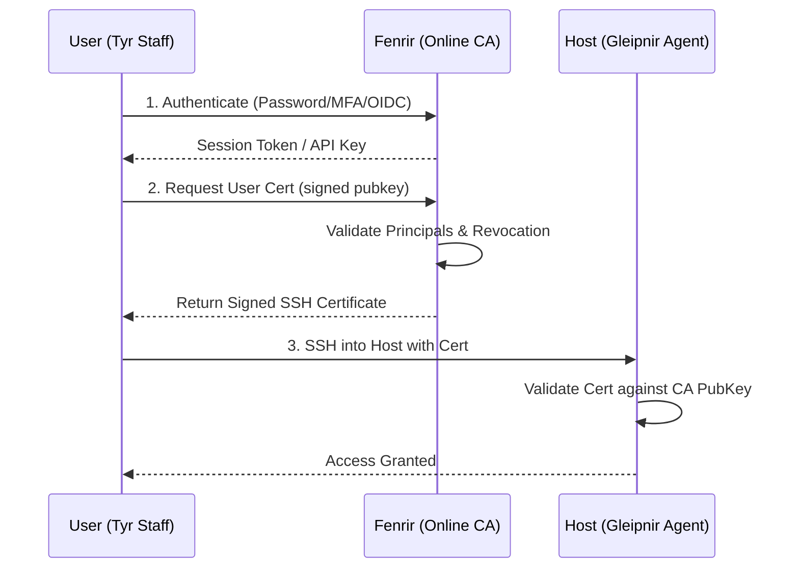

# Fenrir Architecture Documentation

Fenrir is a Norse-themed SSH Certificate Authority designed for security-conscious homelabs. It follows a modular, three-tier architecture to balance usability with high security.

## 🏗 Three-Tier Deployment Model

Fenrir supports three distinct deployment tiers based on the risk profile of the environment.

### 🛡️ Tier 1: Online CA (Standard)

- **Architecture**: A single server (Fenrir) handles both intermediate signing and web UI.
- **Root CA**: The Root CA keys are stored in the same persistent volume as the online server.
- **Use Case**: Internal-only homelabs where convenience is prioritized over air-gapped security.

### ❄️ Tier 2: Cold-Storage Root (Host Backed)

- **Architecture**: Two containers (Root and Intermediate) run on the same host.
- **Root CA**: The Root CA container remains stopped during normal operation. It is only started to issue short-lived intermediate certificates.
- **Use Case**: Improved security without requiring additional hardware. Root keys are isolated from the online daemon's memory except during renewal events.

### 🏔️ Tier 3: Isolated Root (Maximum Security)

- **Architecture**: The Root CA runs on a physically air-gapped machine.
- **Communication**: Intermediate certificate requests are exported and signed offline, then side-loaded back to the online intermediate server over a secure medium (e.g., USB drive).
- **Use Case**: Production-grade homelabs or environments where full Root CA exfiltration must be physically impossible.

---

## 🔑 Security Add-on: Hardware Backing (PKCS#11/HSM)

Any of the three tiers can be enhanced with **Hardware Security Modules (HSMs)** or hardware keys (e.g., YubiKey, Nitrokey).

- **Function**: Private keys are generated inside the hardware and are marked as **non-exportable**.
- **Impact**: Even if an attacker achieves full root access to the Fenrir host, they cannot copy the CA private keys. They can only request signatures while the hardware is physically connected.

---

## 🔄 Core Identity Flow

---

## 📦 Components

- **Fenrir**: The central authority (Go binary). Manages users, groups, audit logs, and certificate signing.
- **Tyr**: The user CLI and workstation client. Handles enrollment, renewals, and SSH configuration.
- **Gleipnir**: The host-side agent. Syncs CA public keys and Key Revocation Lists (KRL). Now automates `pam_fenrir.so` distribution.
- **pam_fenrir**: Allows passwordless `sudo` based on valid SSH certificates. Now supports group-based authorization toggled via Fenrir.

---

## 🔐 Security Components

### PAM Module (`pam_fenrir`)

The PAM module provides a cryptographically secure "fast-path" for authentication and authorization:

- **Challenge-Response**: Challenges the user's `ssh-agent` to sign a nonce, proving possession of the private key.
- **Group Authorization**: Only grants `PAM_SUCCESS` if the certificate contains a principal matching an authorized group.
- **Expiry Validation**: Enforces certificate time limits at the host level.

### Gleipnir Agent

The Gleipnir agent runs on target hosts to maintain the security state:

- **Trust Sync**: Periodically fetches the User CA public key and KRL from Fenrir.
- **PAM Automation**: Automatically downloads and updates the `pam_fenrir.so` module (can be disabled via `--sync-pam=false`).
- **Host Renewal**: Manages the host's own SSH certificate renewal using PoP-based authentication.

---

## 🛡 Managed Sudo Control

Fenrir provides centralized control over `sudo` access:

1. **Admin Toggle**: Groups can be marked as `Sudo Enabled` in the Fenrir Web UI.
2. **Gated Certificates**: The CA only embeds group principals in a certificate if the group has sudo enabled.
3. **Host-Level Enforcement**: `pam_fenrir` on the host verifies these group principals before granting passwordless escalation.

---

## 🛡️ Security Mechanisms

- **PoP (Proof-of-Possession)**: Clients must sign a nonce to prove they still possess the private key during certificate renewal.
- **Secret Zeroization**: Critical buffers (decrypted keys, derived KDF data) are wiped from memory immediately after use.
- **Security Headers**: HSTS, CSP, and X-Frame-Options are enforced on all Web UI interactions.
- **Audit Logging**: All identity-changing events are logged to SQLite and can be streamed to a webhook.
