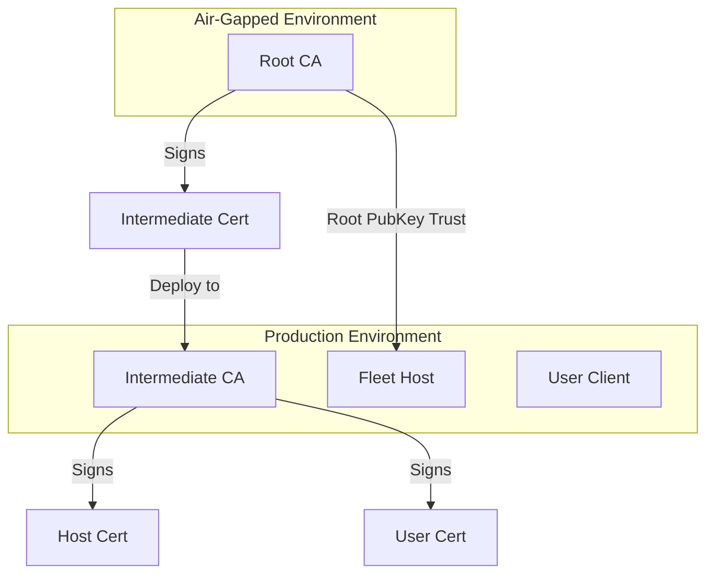

# Tier 3: Isolated Root Setup Guide

This guide provides a deep dive into deploying Fenrir with a **Tier 3: Physically Air-Gapped Root CA**. This is the highest security model, where the Root CA lives on an isolated machine and only comes online to sign Intermediate CAs or generate Revocation Lists (KRLs).

---

## 🏗 Architecture Overview

In a Tier 3 setup, the trust chain is divided:

1.  **Root CA (Offline)**: Holds the "Self-Signed" Root keys. It is never connected to a network.
2.  **Intermediate CA (Online)**: Holds "Intermediate" keys signed by the Root. This handles daily user/host certificate issuance.
3.  **Fleet Hosts**: Configured to trust the **Root CA Public Key**. They will inherently trust any certificate signed by an authorized Intermediate.



---

## 🛡 Part 1: Bootstrapping the Offline Root

Run these steps on your isolated/offline machine.

### 1. Deployment

Use the Tier 3 Root Compose file:

```bash
# Location: deploy/tier-3-isolated/docker-compose.root.yml
docker-compose -f docker-compose.root.yml up -d
```

### 2. Initialization

1.  Log in to the UI at `http://localhost:8080`.
2.  The first run will prompt you to set an admin password.
3.  Navigate to the **Admin Panel** -> **Offline Management** (`/admin/offline`).
4.  **Note the Root Keys**: Copy the **Root User CA Public Key** and **Root Host CA Public Key**. You will need these to configure your fleet.

---

## 🌐 Part 2: Preparing the Online Intermediate

Run these steps on your production/online server.

### 1. Deployment

Use the Tier 3 Intermediate Compose file:

```bash
# Location: deploy/tier-3-isolated/docker-compose.intermediate.yml
docker-compose -f docker-compose.intermediate.yml up -d
```

### 2. Key Generation

The intermediate will start in `online` mode and generate its own fresh keypair.

1.  Locate the generated public keys in your data volume:
    - `./online-data/keys/user_ca.pub`
    - `./online-data/keys/host_ca.pub`
2.  **Export**: Copy these two strings to a secure USB drive to transfer them to the Root CA.

---

## 🔄 Part 3: Synchronization (Signing)

This is the "Ceremony" where the Root CA authorizes the Intermediate.

1.  **At the Root CA**:
    - Log in to `/admin/offline`.
    - Paste the `user_ca.pub` into the **Intermediate CSR** field.
    - Set the type to **User CA Intermediate**.
    - Click **Sign Intermediate Certificate**.
    - **Download** the resulting certificate file.
    - Repeat for `host_ca.pub` (Type: **Host CA Intermediate**).
2.  **At the Online CA**:
    - Place the signed certificates in the `./online-data/keys/` directory.
    - **Crucial**: Name them exactly as follows to ensure Fenrir detects them:
      - `user_ca-cert.pub`
      - `host_ca-cert.pub`
    - Restart the Intermediate CA: `docker-compose restart`.

---

## 🛠 Maintenance & Lifecycle

### 1. Trust Distribution

Your fleet hosts (servers) only need to know the **Root Public Key**.

- Add the **Root User CA Public Key** to `/etc/ssh/sshd_config` under `TrustedUserCAKeys`.
- Add the **Root Host CA Public Key** to `~/.ssh/known_hosts` (on clients) with the `@cert-authority` prefix.

### 2. Revocation (KRL)

If an online Intermediate is compromised:

1.  Boot the **Offline Root**.
2.  Go to **Offline Management** and use the **Emergency Kill Switch**.
3.  Paste the compromised intermediate's public key to revoke it.
4.  Download the generated **KRL (Key Revocation List)**.
5.  Deploy this KRL to all fleet hosts immediately.

### 3. Key Rotation

Intermediate CA keys should be rotated periodically (e.g., every 6-12 months). Since the Root doesn't change, you simply generate new Intermediate keys, sign them on the Root, and replace them on the Online CA without reconfiguring every host in your fleet.
